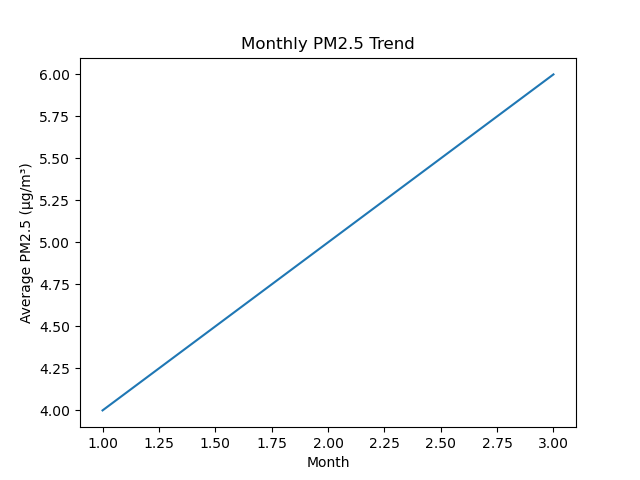
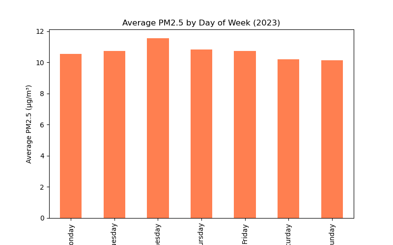

# 🌆 Air Quality Analysis: PM2.5 in Houston (2023)

**By Chisom Mbah**

This project presents an exploratory data analysis of **daily PM2.5 air pollution levels** in **Houston, Texas**, for the year **2023**. PM2.5 refers to fine particulate matter smaller than 2.5 micrometers in diameter — a key indicator of air quality with significant health and environmental impacts.

## 📌 Project Overview

The analysis aims to:

- Track daily, monthly, and weekly trends in PM2.5 concentrations  
- Identify pollution peaks and periods of concern  
- Provide insights to support public health awareness and policy planning  

## 📊 Data Source

- **Source**: [EPA AirData Portal](https://www.epa.gov/outdoor-air-quality-data)  
- **Content**: Daily PM2.5 measurements from monitoring stations in Houston throughout 2023  
- **Format**: CSV with date and PM2.5 concentration columns

## 🧹 Data Preparation

- Loaded the dataset and converted date columns to proper `datetime` format  
- Removed records with missing PM2.5 values  
- Created new features:
  - **Month**
  - **Day of the week**  
  These features allowed for temporal pattern exploration.

## 📈 Exploratory Data Analysis

### 🔹 Daily Trends
Visualized daily PM2.5 levels across the year, revealing noticeable fluctuations and distinct spikes.

### 🔹 Monthly Averages
Identified average PM2.5 concentrations for each month:
- **Highest** in **July**: *20.7 µg/m³*
- **Lowest** in **February**: *10.8 µg/m³*

### 🔹 Weekly Patterns
Compared pollution levels across days of the week to check for weekday–weekend differences.

## 📌 Key Findings

> “The average monthly PM2.5 concentrations in Houston during 2023 varied throughout the year.  
> The **highest average levels** occurred in **July (20.7 µg/m³)**, suggesting a **summer pollution peak**, while the **lowest levels** were seen in **February (10.8 µg/m³)**.”

- **Mid-July** featured the **sharpest spike** in PM2.5, indicating possible acute air quality events.
- **Summer months** generally exhibited worse air quality.

## 🧠 Discussion

The elevated PM2.5 levels in July may be due to:
- Higher temperatures driving **secondary pollutant formation**
- Possible **industrial activity** or **wildfires** in the region

> These levels pose **health risks**, especially for vulnerable populations (children, elderly, and individuals with respiratory issues).  
> **Awareness and timely advisories** are critical to minimizing exposure.

## ✅ Conclusion

Houston experienced elevated PM2.5 concentrations during **summer 2023**, particularly in **July**. These seasonal air quality patterns highlight the importance of:

- Ongoing monitoring  
- Proactive public health communication  
- Mitigation strategies to reduce exposure

## 📁 Files

- `AirQualittyAnalysis.ipynb`: Main notebook with the complete analysis
- `data/`: Contains the PM2.5 dataset
- `README.md`: This project summary and documentation

## 🛠️ Tools Used

- Python  
- Pandas, NumPy  
- Matplotlib, Seaborn  
- Jupyter Notebook

## 👤 Author

**Chisom Mbah**  
GitHub: [@Emychisom](https://github.com/Emychisom)

## 📜 License

This project is licensed under the **MIT License**.
